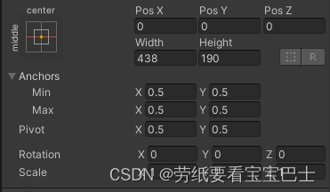
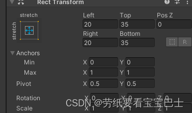
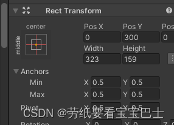
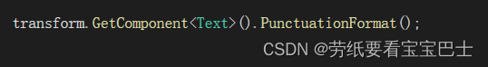
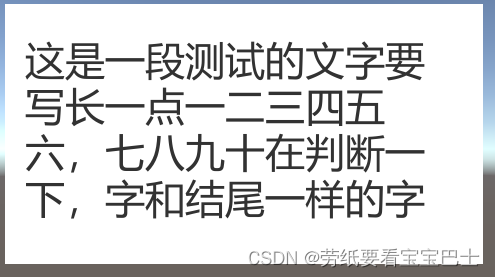

# PunctuationFormatting
一种解决UGUI Text组件标点符号句首情况的方案
# 前言
今天碰到一个需求，项目中有时候的Text的文本会出现标点符号在句首的情况。

需求是标点符号不能出现在句首，而且我们项目是自适应的，不同分辨率下Text的宽不同，这就导致了无论怎样修改文案，都可能会出现标点符号在句首的情况，所以要改进一下。
在网上搜到了一些解决方案的代码，放到项目里发现有问题没办法用，而且比较复杂有点难理解，所以我就研究了一下，写了一个比较简单的解决方案。

# 原理

暴力排序
首先我们要把字符串分割来看。

那么通常情况下，Text应该是这样排列的

相当于先获取到Text文本框的宽度，再获取到当前文本所占的宽（不同汉字的像素宽是不同的，所以没办法准确的获取一个汉字的宽）。
再进行判断，当放到某个字时文本的宽度超出了文本框的宽度，那么就说明这个字是要换行的。
再判断这个字是不是标点符号，是的话就把它和它前面的一个字拿到另一行。
就像这样

那么这样就简单地实现了句首标点符号的处理方法

# 注意

没有加空格的判断，所以文本中尽量不要出现空格

代码我加了对齐方式的判断
目前处理的是这两种对齐方式的对象

Text组件的父对象的对齐方式要是这种

**使用方法**
通过Text组件调用

但是这个代码现在还有个缺陷，那就是经过处理的文本有时候会长短不一，看起来有点丑

但是大部分情况下应该够用了
