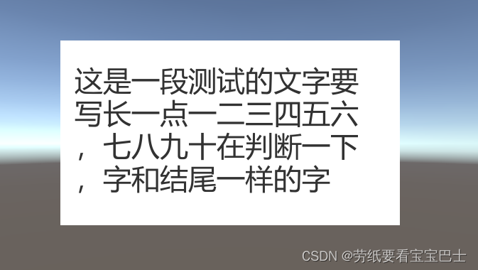

# PunctuationFormatting
一种解决UGUI Text组件标点符号句首情况的方案
# 前言
今天碰到一个需求，项目中有时候的Text的文本会出现标点符号在句首的情况。

需求是标点符号不能出现在句首，而且我们项目是自适应的，不同分辨率下Text的宽不同，这就导致了无论怎样修改文案，都可能会出现标点符号在句首的情况，所以要改进一下。
在网上搜到了一些解决方案的代码，放到项目里发现有问题没办法用，而且比较复杂有点难理解，所以我就研究了一下，写了一个比较简单的解决方案。
